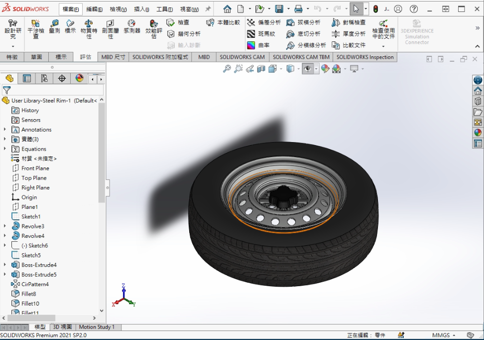
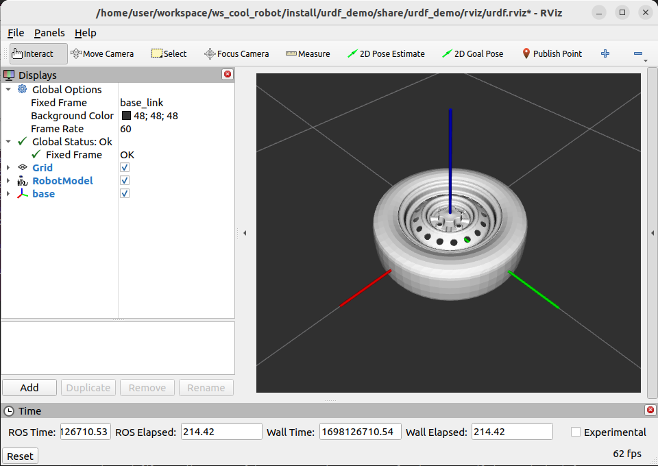
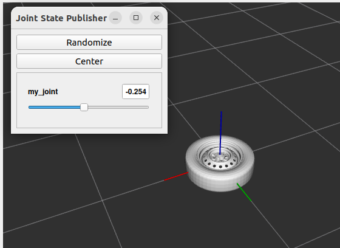
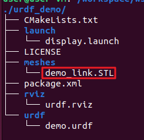
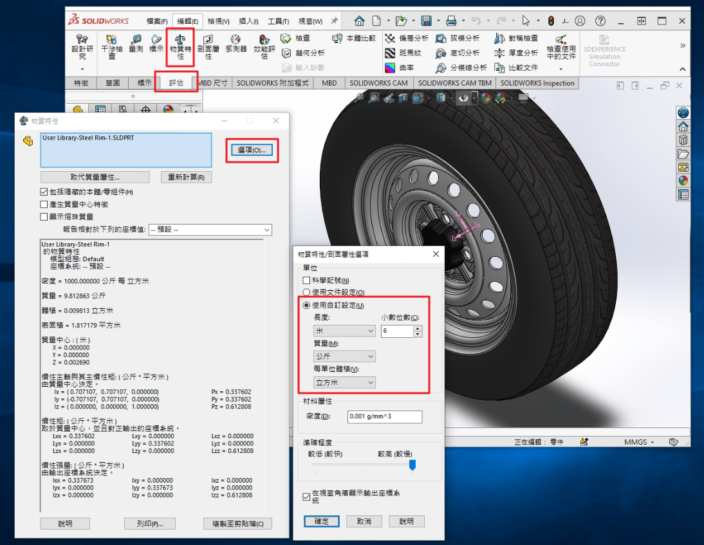
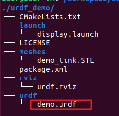
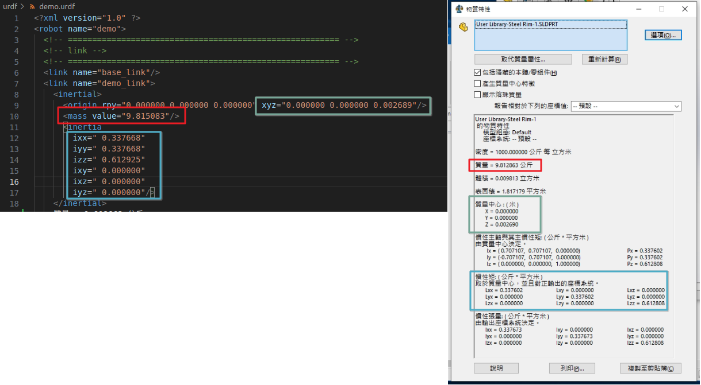
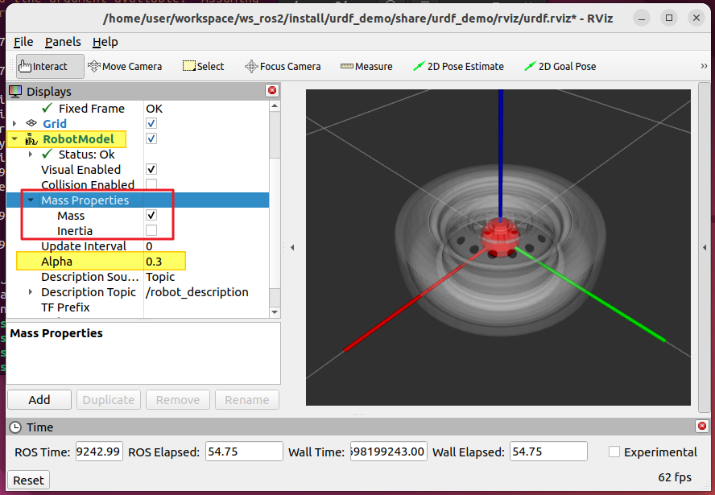

# Readme

透過這個專案來展示如何將SOLIDWORKS的模型透過rviz顯示。






## 0. 製作3D模型

這邊我直接使用SW的素材

https://www.3dcontentcentral.tw/download-model.aspx?catalogid=171&id=230555


## 1. SW零件轉STL

https://www.youtube.com/watch?v=xmGrbbYM0cY

另存新檔，檔案格式選擇STL即可


## 2. 將STL檔放入此urdf demo專案(package)之中

### 第一次使用urdf demo專案

假設已經安裝好[RosTeamWS](https://rtw.stoglrobotics.de/master/index.html)的環境且工作空間的名稱為`ws_ros2`


- 下載

 `ctrl + alt + T` 開啟終端機之後將專案下載下來

```shell
_ws_ros2
rosds
git clone https://github.com/HowardWhile/urdf_demo.git
```

`_ws_ros2` 載入ws_ros2工作空間

`rosds` 進入ROS工作空間的src目錄。

`git clone` 下載專案的版本庫


- 編譯並安裝

 `ctrl + alt + T` 開啟終端機之後書下以下指令

```shell
_ws_ros2
cb urdf_demo
_ws_ros2
```

`cb urdf_demo` 編譯urdf_demo專案。也可以輸入`cb` 編譯整個工作空間

`_ws_ros2` 要再次載入ws_ros2工作空間的原因是，要讓系統可以識別到 `cb` 指令編譯出來的新檔案。


- 試運行

`ctrl + alt + T` 開啟終端機之後書下以下指令，可以看到demo的STL被顯示出來

```shell
_ws_ros2
ros2 launch urdf_demo display.launch
```

`ros2 launch` ros2 launch <專案名稱> <啟動文件名稱>，啟動預設的檔案





### 已經編譯過urdf demo專案

urdf demo專案的檔案內容如下



將`demo_link.STL`利用SW轉出來的STL檔案取代掉

試運行就可以看到導入的STL

```shell
ros2 launch urdf_demo display.launch
```

**注意檔案名稱的大小寫** 在linux中`demo_link.STL`與`demo_link.stl`是不同的檔案。


如果真的找不到工作空間的檔案目錄，可以透過指令來打開該專案的資料夾。

```shell
rosds
nautilus ./urdf_demo/
```

`rosds` 進入ROS工作空間的src目錄。

`nautilus` 鸚鵡螺是ubunut預設的檔案管理員。nautilus <資料夾路徑> 使用檔案管理員開啟資料夾。


## 3. 更新慣性參數

先由SW取得慣性參數

點選評估->物質特性，另外ROS系統採用KMS製所以記得到這邊設定



慣性參數寫在檔案`demo.urdf`之中



將質量填入`<mass>`

將質量中心填入`<origin>`

將慣性矩填入`<inertia>`




## 4. 慣性的參數視覺化

```shell
_ws_ros2
ros2 launch urdf_demo display.launch
```



展開`RobotModel` 與 `Mass Properties`

將`Alpha`透明度調整成`0.3`

勾選Mass或Inertial就可以觀察慣性參數視覺化後的樣子